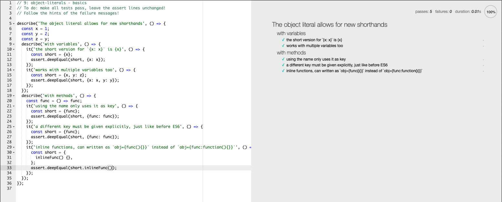

# Submit this assignment by writing a sentence about each topic

## Objects (Test 1)

1. Object Initializer: Objecs can be initialized using new Object(), Object.create() or using the literal notation.

- An object initializer is a comma-delimited list of zero or more pairs of property names and associated values of an object, enclosed in curly braces ({}).

1. Basics: No-install TDD environment, testing object-literals

- using object shorthands in this TDD environment. Very challenging and took me about 30 minutes to complete.

---

## Objects (computed properties)(Test 2)

- This allows you to put an expression in brackets [] that will be computed and used as the property name.

---

## Classes (Test 3)

- Classes are a template for creating objects. They encapsulate data with code to work on that data. Classes in JS are built on prototypes but also have some syntax and semantics that are not shared with ES5 classalike semantics.

- Using the same name with two class declarations in the same scope is a syntax error; with a function declaration, the second one wins, overwriting the first.

---

## Destructuring (Test 4)

- The destructuring assignment syntax is a JavaScript expression that makes it possible to unpack values from arrays, or properties from objects, into distinct variables.

### Array Destructing

- A variable can be assigned a default, in the case that the value unpacked from the array is undefined.
- It's always been possible to return an array from a function. Destructuring can make working with an array return value more concise.

### Object Destructing

- A variable can be assigned its value with destructuring separate from its declaration.
- A property can be both:
  - Unpacked from an object and assigned to a variable with a different name.
  - Assigned a default value in case the unpacked value is undefined.

### Destructing with Defaults

- A variable can be assigned a default, in the case that the value unpacked from the object is undefined.
- A variable can be assigned a default, in the case that the value unpacked from the array is undefined.

---

## Rest

- The rest parameter syntax allows us to represent an indefinite number of arguments as an array.

### Rest as a Parameter

- A function's last parameter can be prefixed with ... which will cause all remaining (user supplied) arguments to be placed within a "standard" JavaScript array.

- Only the last parameter can be a "rest parameter".

### Rest while Destructuring

- Rest properties collect the remaining own enumerable property keys that are not already picked off by the destructuring pattern. Those keys and their values are copied onto a new object.

---

## Spread

### Array Spread

- Just like spread for argument lists, ... can be used anywhere in the array literal, and may be used more than once.

---

## Function Defaults

### Function Defaults

- Default function parameters allow named parameters to be initialized with default values if no value or undefined is passed.
